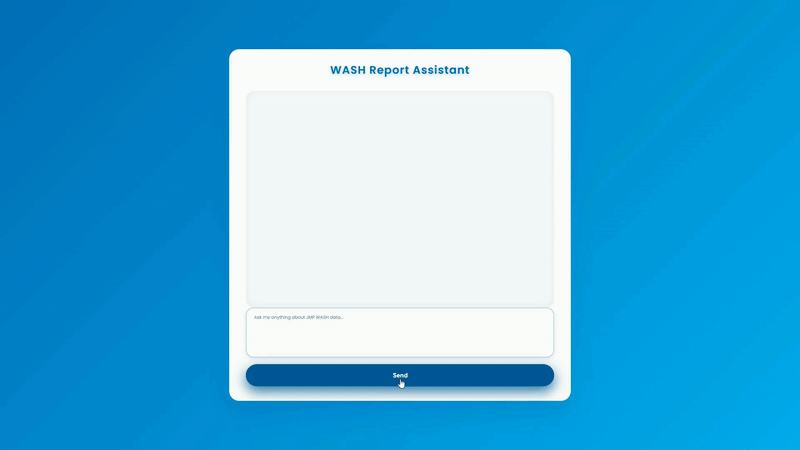

## WASH Report Assistant: Dual-Language LLM Q&A System ##



**Project Overview**

**WASH Report Assistant** is an AI-powered chatbot designed to answer questions about WASH (Water, Sanitation, and Hygiene) data using curated Excel datasets. The system leverages a retrieval-augmented generation (RAG) pipeline with **LLaMA3-70B via Groq API** for concise, context-aware answers in both English and Bangla. The backend is built with Flask, using **Sentence Transformers** for embeddings and **Pinecone** for semantic vector search.

---

🔍 **How It Works**

1. **Data Extraction & Cleaning**
   * Raw Excel files are processed using `data_cleaner.py` to extract only relevant rows and columns from each sheet.

2. **Semantic Chunking**
   * Cleaned data is divided into thematic chunks using `chunker.py`, grouping by topic where available.

3. **Embedding & Vector Storage**
   * Each chunk is embedded using the `all-MiniLM-L6-v2` model.
   * Embeddings, along with topic and sheet metadata, are stored in a Pinecone vector database.

4. **Real-Time Query Flow**
   * User submits a question via the Flask web interface.
   * The question is embedded and used to search for relevant chunks in Pinecone.
   * Retrieved context is sent to the Groq LLM (LLaMA3-70B) for a concise, one-line answer.
   * If the question is in Bangla, the answer is translated using the same LLM.

---

🔧 **Key Technologies**

* **Frontend**: Flask + Responsive HTML/CSS Chat UI
* **Backend**: Python (Pandas, Openpyxl, Sentence Transformers, Groq API, Pinecone)
* **Vector Database**: Pinecone
* **Embedding Model**: all-MiniLM-L6-v2
* **LLM**: Groq (LLaMA3-70B)

---

📦 **Setup Instructions**

1. **Clone the Repository**

```bash
git clone https://github.com/AnthropoidFHJ/LLM-based-Dual-Language-Assignment
cd {path}/LLM-based-Dual-Language-Assignment
```

2. **Create the Environment**

```bash
conda create -n ACME-AI python=3.13 -y
conda activate ACME-AI
```

3. **Install Requirements**

```bash
pip install -r requirements.txt
```

4. **Prepare Data**

- Place your raw Excel data in the `data/` directory.

5. **Configure Environment Variables**

Create a `.env` file in the root directory and add:

```env
PINECONE_API_KEY="Your_actual_Pinecone_Key"
GROQ_API_KEY="Your_actual_Groq_Key"
PINECONE_ENV="your-pinecone-environment"
PINECONE_INDEX_NAME="wash-report"
```

6. **Run the Data Pipeline**

```bash
python main.py
```
This will sequentially run:
- `data_processing/data_cleaner.py`
- `data_processing/chunker.py`
- `pinecone_db/embeddings.py`
- `app.py`

Visit: [http://localhost:8085](http://localhost:8085)

---

⚙️ **Workflow Summary**

```
Excel Data → Cleaned Data → Thematic Chunks → Embeddings → Pinecone Index
                                                                 ↓
                                        Query Embedding →  Knowledge Base
                                                                 ↓
                                                            Ranked Result → Groq LLM → Answer (EN/BN)
```

---

🌟 **Future Enhancements**

* Add user authentication and session history
* Integrate advanced filtering by topic or sheet
* Support for uploading new datasets via the UI
* Add streaming responses and AJAX chat updates
* Expand language support and translation quality

---

🧪 **Deployment History**

* **Prototype**: Developed in VS Code, modularized for clarity
* **Data Pipeline**: Automated via `main.py` script
* **Vector DB**: Pinecone index creation and upsert handled in `embeddings.py`
* **Web UI**: Responsive chat interface with dual-language support

---

**This project is developed as part of the ACME-AI Fellowship Assignment to provide users with fast, accurate, and AI-powered insights into WASH (Water, Sanitation, and Hygiene) data, accessible in both English and Bangla.**

---

**Author:** Ferdous Hasan  
**Date:** 19 July 2025
